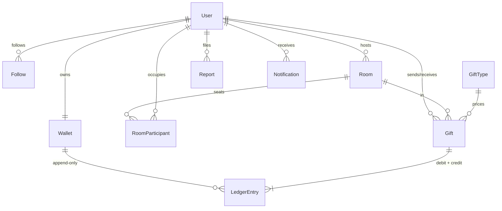

# Roomies — Live Audio-Room Social Platform

A full-stack app for live audio rooms — real-time voice (WebRTC), live chat and
presence (websockets), follows, virtual gifting with a double-entry wallet ledger,
and moderation. Django REST + Channels backend, React frontend.
**Postgres + Redis + Celery, 117 tests, Dockerised.**

Built the way live social products (think FRND / Clubhouse) actually work: people join
audio rooms, follow hosts, send virtual gifts, and get moderated. The gifting economy is
the centrepiece — money only ever moves by inserting append-only ledger rows inside a
single transaction, with row locking and idempotency keys, so coins cannot be created,
destroyed, or double-spent under concurrent load.

## Stack

| Layer     | Choice                          |
|-----------|---------------------------------|
| Backend   | Django 5 + Django REST Framework |
| Realtime  | Django Channels (daphne ASGI) — chat, presence, WebRTC signaling over websockets |
| Audio     | WebRTC peer-to-peer mesh; the server only brokers the handshake |
| Frontend  | React 19 + Vite SPA, served by nginx (same-origin /api + /ws proxy — no CORS) |
| Database  | PostgreSQL 16 (SQLite fallback for quick local hacking) |
| Cache     | Redis (versioned live-feed cache, 30 s TTL) |
| Async     | Celery + Redis broker (notification fan-out) |
| Auth      | Phone-first OTP → JWT (simplejwt) |
| Testing   | pytest + pytest-django + factory_boy — 117 tests |
| Container | Docker + docker-compose          |
| CI        | GitHub Actions (Postgres + Redis service containers) |

## Architecture



Request path for a gift:

```mermaid
sequenceDiagram
    Client->>API: POST /rooms/{id}/gifts/ (Idempotency-Key)
    API->>DB: BEGIN; SELECT wallets FOR UPDATE (pk order)
    API->>DB: check balance, INSERT gift
    API->>DB: INSERT ledger debit + credit (sum = 0)
    API->>DB: UPDATE cached balances; COMMIT
    API-->>Client: 201 (or 200 replay on retry)
```

## Setup (three commands)

With Docker:

```bash
cp .env.example .env
docker compose up --build
docker compose exec web python manage.py seed_demo
```

Then open **http://localhost:3000** — the full web app (log in with a seeded
phone like `+919876500000`, OTP `123456`). The API and Swagger docs are on
http://localhost:8000/api/v1/docs/.

Without Docker (SQLite + in-process Celery, zero services needed):

```bash
pip install -r requirements.txt
python manage.py migrate && python manage.py seed_demo
python manage.py runserver
```

Then log in: `POST /api/v1/auth/request-otp/` with any seeded phone
(e.g. `+919876500000`), then `POST /api/v1/auth/verify-otp/` with code `123456`.
Interactive docs at `/api/v1/docs/`, OpenAPI schema at `/api/v1/schema/`.

> **Dev OTP note:** while `OTP_DEV_MODE` is on (default in DEBUG), the OTP is the fixed
> `DEV_OTP_CODE` and is echoed in the response so the flow works without an SMS
> provider. In production you set `OTP_DEV_MODE=0` and wire a real gateway.

## Endpoints

| Method | Path | Description |
|--------|------|-------------|
| POST | `/api/v1/auth/request-otp/` | Send OTP to a phone (throttled 5/min) |
| POST | `/api/v1/auth/verify-otp/` | OTP → JWT pair; creates user on first login |
| POST | `/api/v1/auth/refresh/` | Refresh the access token |
| GET/PATCH | `/api/v1/me/` | Own profile |
| GET | `/api/v1/users/{id}/` | Public profile |
| POST/DELETE | `/api/v1/users/{id}/follow/` | Follow / unfollow (idempotent) |
| GET | `/api/v1/users/{id}/followers/` | Followers (cursor-paginated) |
| GET | `/api/v1/users/{id}/following/` | Following (cursor-paginated) |
| GET | `/api/v1/notifications/` | Own notifications ("host went live") |
| GET | `/api/v1/users/suggested/` | Who to follow (most-followed, minus already-followed) |
| GET | `/api/v1/leaderboard/` | Top hosts by coins received |
| POST | `/api/v1/rooms/` | Go live (host auto-seated, followers notified async) |
| GET | `/api/v1/rooms/?status=live&topic=music&country=IN&search=lofi` | Live feed (cached 30 s, searchable) |
| GET | `/api/v1/rooms/{id}/` | Room detail |
| POST | `/api/v1/rooms/{id}/join/` | Take a seat (409 when full) |
| POST | `/api/v1/rooms/{id}/leave/` | Leave (seat history kept) |
| POST | `/api/v1/rooms/{id}/end/` | End the room (host only) |
| GET | `/api/v1/rooms/{id}/participants/` | Active participants |
| GET | `/api/v1/wallet/` | Balance + recent ledger entries |
| POST | `/api/v1/wallet/topup/` | Credit coins (payment-gateway stub) |
| GET | `/api/v1/gift-types/` | Gift catalog |
| POST | `/api/v1/rooms/{id}/gifts/` | Send a gift; omit `recipient_id` to split it across the stage |
| GET/POST | `/api/v1/rooms/{id}/questions/` | Paid question queue (stake escrowed on ask) |
| POST | `/api/v1/rooms/{id}/questions/{qid}/answer/` | Release the stake to the host |
| POST | `/api/v1/rooms/{id}/questions/{qid}/decline/` | Refund the asker |
| GET/POST | `/api/v1/rooms/{id}/pledges/` | Pledge toward a room goal (all-or-nothing escrow) |
| GET | `/api/v1/users/{id}/stats/` | Public, ledger-derived host reputation |
| POST | `/api/v1/rooms/{id}/recording/` | Upload the browser-mixed room audio (host only) |
| GET | `/api/v1/rooms/{id}/replay/` | Audio URL + merged timeline (chat, captions, gifts, questions) |
| GET | `/api/v1/rooms/{id}/gifts/history/` | Gifts sent in a room |
| GET | `/api/v1/rooms/{id}/messages/` | Chat history (last 50) |
| POST | `/api/v1/rooms/{id}/participants/{uid}/role/` | Promote/demote speaker (host only) |
| POST/GET | `/api/v1/reports/` | File / list reports (staff see all) |
| PATCH | `/api/v1/reports/{id}/` | Review a report (staff only) |
| GET | `/api/v1/schema/`, `/api/v1/docs/` | OpenAPI schema / Swagger UI |
| WS | `/ws/rooms/{id}/?token=<jwt>` | Chat, presence, reactions, speaking state, WebRTC signaling |

Errors carry a stable machine-readable code, e.g.
`{"code": "insufficient_balance", "detail": "Not enough coins."}` — clients branch on
the code, not on English text.

## Frontend

`frontend/` is a React 19 + Vite single-page app covering the whole product
surface: OTP login, the live-room feed with topic filters and go-live, room
pages with join/leave/end, the gift catalog with live wallet balance, the
double-entry ledger view, profiles with follow/unfollow, and notifications.
It talks to the API exclusively through relative `/api/...` URLs; the Vite
dev server (locally) or nginx (in Docker) proxies those to Django, so the
browser sees one origin and CORS never needs configuring. JWTs are attached
by a small fetch wrapper that transparently refreshes an expired access
token once and retries. Live audio itself (WebRTC) is out of scope — rooms,
seats, presence and gifting are fully real.

Local frontend dev: `cd frontend && npm install && npm run dev` (backend on
:8000 via Docker or `manage.py runserver`), then http://localhost:5173.

## Real-time architecture

Each room has one websocket per participant (JWT-authenticated via query
param — browsers can't set headers on websockets). The socket multiplexes:

- **chat** — persisted to Postgres, broadcast via the Redis channel layer
- **presence** — peer_joined / peer_left, so the UI updates without polling
- **speaking / mic / reactions** — ephemeral UI state, broadcast, never stored
- **signal** — WebRTC offers/answers/ICE relayed to exactly one target peer

Voice is a **peer-to-peer WebRTC mesh**: the backend never touches audio, it
only brokers the handshake, which is how it stays cheap at small room sizes
(a mesh is O(n²) connections — the documented next step for big rooms is an
SFU like LiveKit). Speaker permission is enforced socially: the host promotes
listeners to speakers, and the mic button only renders for speakers/host.
Speaking indicators run on a local AudioContext analyser and broadcast state
changes, not audio.

## Design decisions

### The double-entry ledger

`Wallet.balance_coins` is a **cache, not the source of truth** — the balance is always
derivable as `SUM(ledger.delta_coins)`. Coins move only inside `services.send_gift`:

1. One `transaction.atomic()` block for the whole movement.
2. Both wallets locked with `select_for_update()`, **always in ascending pk order** —
   concurrent gifts A→B and B→A acquire locks in the same order, so they cannot deadlock.
3. Exactly two ledger rows per gift (debit + credit) that must sum to zero.
4. A DB-level `CHECK (balance_coins >= 0)` constraint as the last line of defence.

Verified by a concurrency test that fires 10 simultaneous gifts from a wallet holding
enough for 3 and asserts exactly 3 succeed with the balance never going negative
(runs against Postgres in CI; SQLite has no row locks, so it auto-skips locally).

### Escrow: coins in flight live in a real wallet

Paid questions and goal pledges hold coins *between* two people. Rather than
marking a row "pending" and hoping the balance maths works out, the coins
physically move into a system escrow wallet (`Wallet.escrow()`, `user=NULL`)
and leave it exactly once — to the host when a question is answered or a goal
is funded, or back to the payer on decline / room end. Because escrow is a
real account, the global invariant `SUM(all ledger deltas) == total top-ups`
holds at *every* instant, including mid-flight. Tests assert exactly that
across full lifecycles.

Three product features fall out of this one primitive:

- **Paid question queue** — listeners stake coins on a question; the queue is
  ordered by stake, and the host is paid only on answering. Unanswered
  questions are refunded automatically when the room ends.
- **Goal rooms** — Kickstarter mechanics inside a live room. Pledges are
  escrowed; reaching the target settles everything to the host, ending short
  refunds every backer.
- **Co-host revenue splits** — a gift sent to the *room* (no `recipient_id`)
  is divided across everyone on stage in proportion to their speaking time,
  measured from `RoomParticipant.speaker_since`. Shares use the
  largest-remainder method so the parts sum to exactly the gift value —
  naive rounding would create or destroy coins, which the ledger forbids.

### Recording, captions and time-boxing without a media budget

Three features that normally need expensive infrastructure, built so they
cost nothing to run:

- **Recordings & replay** — the host's browser mixes every peer stream into
  one track with the Web Audio API and uploads a single file when they stop.
  The server never joins the media path. The replay page pairs that audio
  with a merged, timestamped timeline of everything that happened (chat,
  captions, gifts, questions); clicking any line seeks the audio to that
  moment. Rooms with no recording still have a complete transcript.
- **Live captions** — speech recognition runs in the speaker's own browser
  (Web Speech API), so there is no ASR vendor and no per-minute cost. Final
  phrases are broadcast over the existing room websocket for accessibility
  and persisted to build the replay transcript.
- **Time-boxed rooms** — an optional hard stop. Expired rooms are excluded
  from the live feed in the same query that builds it (no extra cost),
  closed on first retrieve, and swept authoritatively by a Celery task that
  runs the same `close_room` path as a manual end — so escrowed question
  stakes and unfunded pledges are refunded exactly the same way.

### Idempotency keys

Gifting requires an `Idempotency-Key` header, unique-indexed on the gift. A client retry
after a timeout (or a double tap) returns the original gift with `200` instead of
charging twice. The unique index makes this race-proof: if two identical requests slip
past the pre-check, one insert loses and the winner's row is returned.

### Cursor pagination, not offset

Offset pages drift when rows are inserted mid-scroll — very likely on a live feed — and
`OFFSET n` scans get slower the deeper you page. A cursor keyed on an indexed timestamp
is stable and O(page size).

### Versioned cache invalidation

The live-room feed is cached in Redis for 30 s. Instead of deleting every cached
page/filter combination on invalidation (an unbounded key set), every key embeds a
version counter that gets bumped by a signal when a room goes live or ends. Old keys
simply expire.

### N+1-free feed

The room list is one query regardless of row count: `select_related("host")` folds the
host join in, and an annotated `Count(participants, filter=...)` replaces a per-room
`COUNT(*)`. Enforced by a test wrapping the endpoint in `assertNumQueries(1)`.

### Fan-out off the request path

Going live enqueues a Celery task that bulk-creates a notification per follower, so
room creation stays O(1) for the host no matter their follower count. Without a Redis
broker configured, tasks run eagerly in-process — local dev needs zero services.

## Tests

```bash
pytest --cov
```

58 tests: auth flows, permissions, room capacity under lock, ledger invariants
(zero-sum entries, balance == ledger sum, price frozen at send time), idempotent
replays, the concurrent-overspend case, cache invalidation, notification fan-out, and
moderation visibility rules. CI runs the full suite against real Postgres and Redis on
every push.
