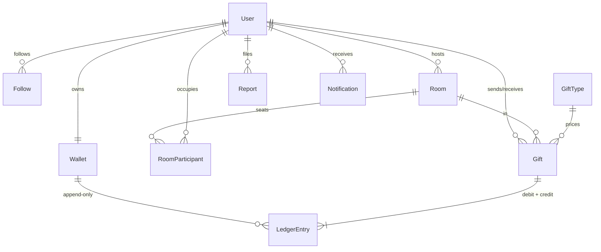

# Roomies — Live Audio-Room Social Backend

A Django REST backend for live audio rooms — hosting, follows, virtual gifting with a
double-entry wallet ledger, and moderation. **Postgres + Redis + Celery, 58 tests, Dockerised.**

Built the way live social products (think FRND / Clubhouse) actually work: people join
audio rooms, follow hosts, send virtual gifts, and get moderated. The gifting economy is
the centrepiece — money only ever moves by inserting append-only ledger rows inside a
single transaction, with row locking and idempotency keys, so coins cannot be created,
destroyed, or double-spent under concurrent load.

## Stack

| Layer     | Choice                          |
|-----------|---------------------------------|
| Framework | Django 5 + Django REST Framework |
| Database  | PostgreSQL 16 (SQLite fallback for quick local hacking) |
| Cache     | Redis (versioned live-feed cache, 30 s TTL) |
| Async     | Celery + Redis broker (notification fan-out) |
| Auth      | Phone-first OTP → JWT (simplejwt) |
| Testing   | pytest + pytest-django + factory_boy — 58 tests |
| Container | Docker + docker-compose          |
| CI        | GitHub Actions (Postgres + Redis service containers) |

## Architecture



Request path for a gift:

```mermaid
sequenceDiagram
    Client->>API: POST /rooms/{id}/gifts/ (Idempotency-Key)
    API->>DB: BEGIN; SELECT wallets FOR UPDATE (pk order)
    API->>DB: check balance, INSERT gift
    API->>DB: INSERT ledger debit + credit (sum = 0)
    API->>DB: UPDATE cached balances; COMMIT
    API-->>Client: 201 (or 200 replay on retry)
```

## Setup (three commands)

With Docker:

```bash
cp .env.example .env
docker compose up --build
docker compose exec web python manage.py seed_demo
```

Without Docker (SQLite + in-process Celery, zero services needed):

```bash
pip install -r requirements.txt
python manage.py migrate && python manage.py seed_demo
python manage.py runserver
```

Then log in: `POST /api/v1/auth/request-otp/` with any seeded phone
(e.g. `+919876500000`), then `POST /api/v1/auth/verify-otp/` with code `123456`.
Interactive docs at `/api/v1/docs/`, OpenAPI schema at `/api/v1/schema/`.

> **Dev OTP note:** while `OTP_DEV_MODE` is on (default in DEBUG), the OTP is the fixed
> `DEV_OTP_CODE` and is echoed in the response so the flow works without an SMS
> provider. In production you set `OTP_DEV_MODE=0` and wire a real gateway.

## Endpoints

| Method | Path | Description |
|--------|------|-------------|
| POST | `/api/v1/auth/request-otp/` | Send OTP to a phone (throttled 5/min) |
| POST | `/api/v1/auth/verify-otp/` | OTP → JWT pair; creates user on first login |
| POST | `/api/v1/auth/refresh/` | Refresh the access token |
| GET/PATCH | `/api/v1/me/` | Own profile |
| GET | `/api/v1/users/{id}/` | Public profile |
| POST/DELETE | `/api/v1/users/{id}/follow/` | Follow / unfollow (idempotent) |
| GET | `/api/v1/users/{id}/followers/` | Followers (cursor-paginated) |
| GET | `/api/v1/users/{id}/following/` | Following (cursor-paginated) |
| GET | `/api/v1/notifications/` | Own notifications ("host went live") |
| POST | `/api/v1/rooms/` | Go live (host auto-seated, followers notified async) |
| GET | `/api/v1/rooms/?status=live&topic=music&country=IN` | Live feed (cached 30 s) |
| GET | `/api/v1/rooms/{id}/` | Room detail |
| POST | `/api/v1/rooms/{id}/join/` | Take a seat (409 when full) |
| POST | `/api/v1/rooms/{id}/leave/` | Leave (seat history kept) |
| POST | `/api/v1/rooms/{id}/end/` | End the room (host only) |
| GET | `/api/v1/rooms/{id}/participants/` | Active participants |
| GET | `/api/v1/wallet/` | Balance + recent ledger entries |
| POST | `/api/v1/wallet/topup/` | Credit coins (payment-gateway stub) |
| GET | `/api/v1/gift-types/` | Gift catalog |
| POST | `/api/v1/rooms/{id}/gifts/` | Send a gift (Idempotency-Key required, throttled 30/min) |
| GET | `/api/v1/rooms/{id}/gifts/history/` | Gifts sent in a room |
| POST/GET | `/api/v1/reports/` | File / list reports (staff see all) |
| PATCH | `/api/v1/reports/{id}/` | Review a report (staff only) |
| GET | `/api/v1/schema/`, `/api/v1/docs/` | OpenAPI schema / Swagger UI |

Errors carry a stable machine-readable code, e.g.
`{"code": "insufficient_balance", "detail": "Not enough coins."}` — clients branch on
the code, not on English text.

## Design decisions

### The double-entry ledger

`Wallet.balance_coins` is a **cache, not the source of truth** — the balance is always
derivable as `SUM(ledger.delta_coins)`. Coins move only inside `services.send_gift`:

1. One `transaction.atomic()` block for the whole movement.
2. Both wallets locked with `select_for_update()`, **always in ascending pk order** —
   concurrent gifts A→B and B→A acquire locks in the same order, so they cannot deadlock.
3. Exactly two ledger rows per gift (debit + credit) that must sum to zero.
4. A DB-level `CHECK (balance_coins >= 0)` constraint as the last line of defence.

Verified by a concurrency test that fires 10 simultaneous gifts from a wallet holding
enough for 3 and asserts exactly 3 succeed with the balance never going negative
(runs against Postgres in CI; SQLite has no row locks, so it auto-skips locally).

### Idempotency keys

Gifting requires an `Idempotency-Key` header, unique-indexed on the gift. A client retry
after a timeout (or a double tap) returns the original gift with `200` instead of
charging twice. The unique index makes this race-proof: if two identical requests slip
past the pre-check, one insert loses and the winner's row is returned.

### Cursor pagination, not offset

Offset pages drift when rows are inserted mid-scroll — very likely on a live feed — and
`OFFSET n` scans get slower the deeper you page. A cursor keyed on an indexed timestamp
is stable and O(page size).

### Versioned cache invalidation

The live-room feed is cached in Redis for 30 s. Instead of deleting every cached
page/filter combination on invalidation (an unbounded key set), every key embeds a
version counter that gets bumped by a signal when a room goes live or ends. Old keys
simply expire.

### N+1-free feed

The room list is one query regardless of row count: `select_related("host")` folds the
host join in, and an annotated `Count(participants, filter=...)` replaces a per-room
`COUNT(*)`. Enforced by a test wrapping the endpoint in `assertNumQueries(1)`.

### Fan-out off the request path

Going live enqueues a Celery task that bulk-creates a notification per follower, so
room creation stays O(1) for the host no matter their follower count. Without a Redis
broker configured, tasks run eagerly in-process — local dev needs zero services.

## Tests

```bash
pytest --cov
```

58 tests: auth flows, permissions, room capacity under lock, ledger invariants
(zero-sum entries, balance == ledger sum, price frozen at send time), idempotent
replays, the concurrent-overspend case, cache invalidation, notification fan-out, and
moderation visibility rules. CI runs the full suite against real Postgres and Redis on
every push.
